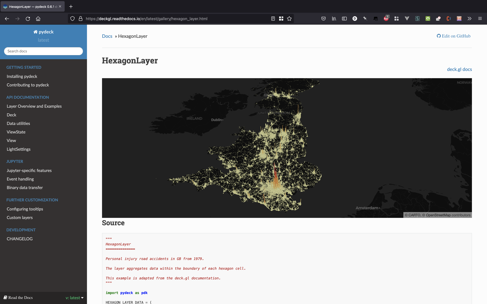

# deck.gl 
deck.gl visualizes large geospatial datasets. 

[](https://deckgl.readthedocs.io/en/latest/)

Trame developers can make interactive data layers on top of base map providers like [Mapbox](https://github.com/Kitware/trame/blob/3cec4490d9a550d61e44dc1a4c1b059c66a2ce54/examples/PlainPython/GeoMaps/MappingDemo/app.py#L10). This [gallery](https://deckgl.readthedocs.io/en/latest/) documents the capabilities of deck.gl in Python.

```python
from trame.html import deckgl
import pydeck as pdk
import pandas as pd


# Data layer
layers = [
    pdk.Layer(
        "HexagonLayer",
        data=pd.read_json("./bike_rental_stats.json"),
        get_position=["lon", "lat"],
        radius=200,
        elevation_scale=4,
        elevation_range=[0, 1000],
        extruded=True,
    )
]

initial_view_state = {
    "latitude": 37.76,
    "longitude": -122.4,
    "zoom": 11,
    "pitch": 50,
}

deck = pdk.Deck(**initial_state_view, **layers)

# UI Component
myMap = deckgl.Deck(deck)
```

# Interactivity
Trame's deck.gl component can make maps interactive by responding to updates in the data. When clicked, this Vuetify button will adjust the map by 10 degress latitude. More examples of interactive maps in Trame are [here](https://github.com/Kitware/trame/blob/master/examples/PlainPython/GeoMaps/UberPickupsNYC) and [here](https://github.com/Kitware/trame/blob/master/examples/PlainPython/GeoMaps/MappingDemo).
```python
# Continued from example above...

def increase_latitude():
    initial_state_view["latitude"] += 1
    updatedDeck = pdk.Deck(**initial_state_view, **layers)

    myMap.update(updatedDeck) # Update UI component

VBtn("Increase latitude", click=increase_latitude)
```
