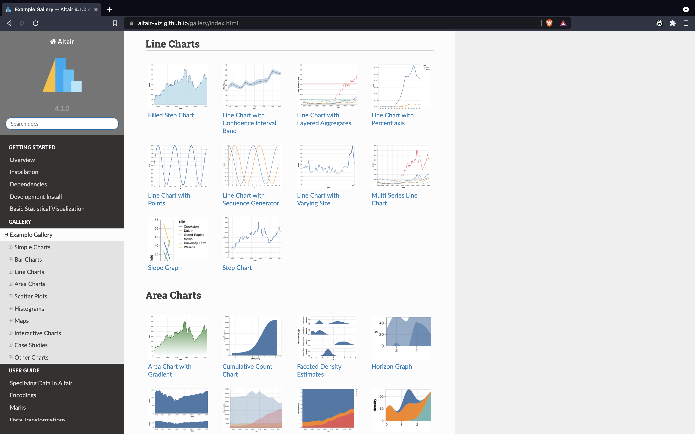

# Vega 
Trame supports powerful visualization grammars like Vega through easy-to-use libraries like Altair (see documentation [here](https://altair-viz.github.io/gallery/index.html)) for concise visualization.

```python
from vuetify.html import vega
from vega_datasets import data
import altair as alt

# Make chart from example dataset
myChart = alt.Chart(data.cars()).mark_point().encode(
    x='Horsepower',
    y='Miles_per_Gallon',
    color='Origin',
)

# Method 1 ----------------------------------------------------------------------

chart_component = vega.VegaEmbed(myChart)
chart_component.update(myChart2) # Make change

# Method 2 ----------------------------------------------------------------------

chart_component2 = vega.VegaEmbed(
    name="myChart", # Shared state name for vega chart
)
chart_component2.update(myChart)  # Set chart
chart_component2.update(myChart2) # Make change
```

[](https://altair-viz.github.io/index.html)

