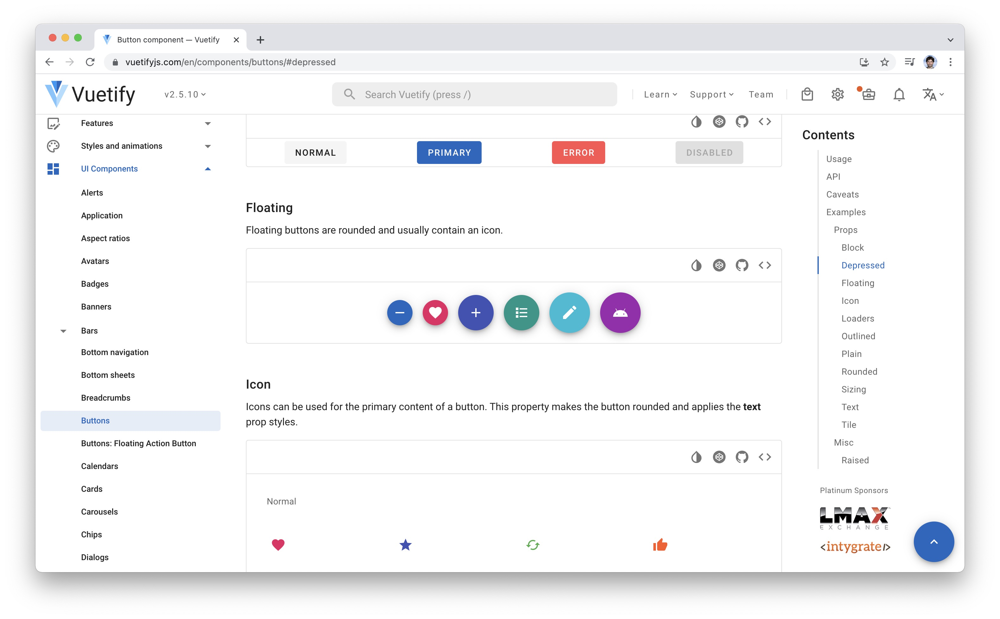
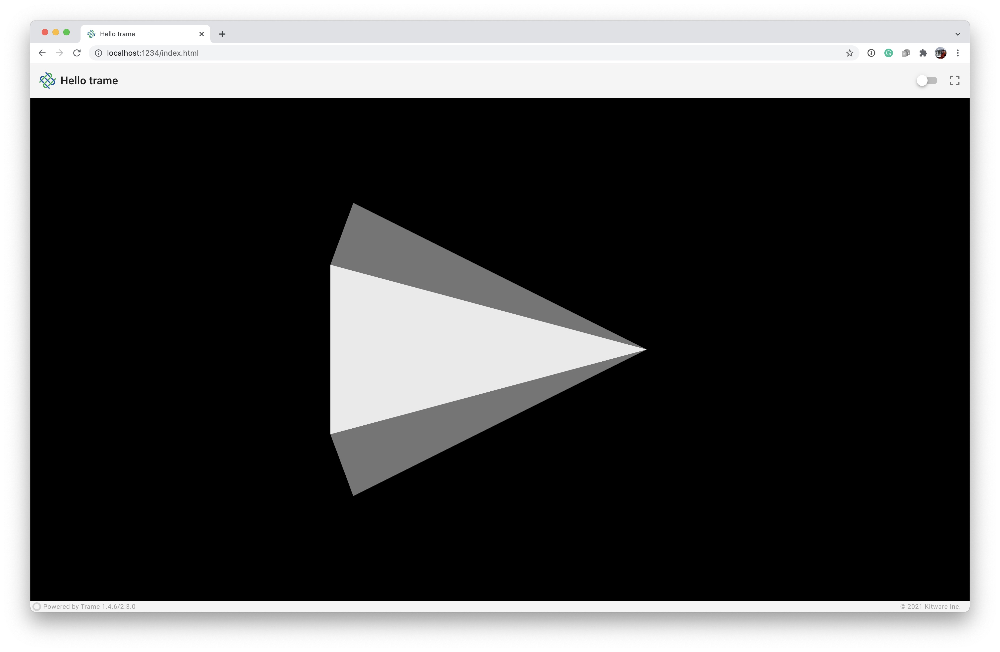

# HTML

***trame*** leverages Vuetify as its primary UI Component Library for defining HTML graphics user interfaces (GUI). [Vuetify](https://vuetifyjs.com/en/introduction/why-vuetify/#what-is-vuetify3f) is a mature, efficient, and expansive framework for good-looking web applications with the same simple state management system as ***trame***. ***trame*** makes Vuetify available in your Python with minimal overhead.

[](https://vuetifyjs.com/en/)

<div class="print-break"></div>

## Using Vuetify

We expose all Vuetify components. As an example, let's look at how we would make a simple text box. This is taken from Vuetify's excellent [examples and documentation](https://vuetifyjs.com/en/components/text-fields/), which we recommend you consult while writing frontends with ***trame***.

```javascript
// Somewhere in javascript
const currentSuffix = "lbs";
const myWeight = 28.0;
```
```html
<!-- Somewhere in html -->
<v-text-field label="Weight" v-model="myWeight" :suffix="currentSuffix"></v-text-field>
```


Here we have a vuetify text field (`v-text-field`). In Vue, the `v-model` is a directive that provides two-way data binding between an input and form data or between two components. The variable `myWeight` is bound by the `v-model` attribute, so the shared state can read from it (shown in the GUI form) and write to it (input to the form stored as the variable contents).

We've included, optionally, a `label` and a `suffix` for the text box. The `label` is a static string or title, and the `suffix` could be a static string, but the "`:`" in `:suffix` means we will look up and use the contents of a variable `currentSuffix`. This variable could change to 'kg' if our user prefers the metric system.

Looking through the Vuetify documentation, we see a large number of wonderful user interface (UI) components. ***trame*** exposes Vuetify from within Python. Access to Vuetify is provided through ***trame*** using the following import.

```python
from trame.html import vuetify
```

## Python Vuetify Rules

Exposing Vuetify in Python was accomplished by making a few syntax changes.

1. We use CamelCase in our Python component's name, while attribute hyphens become underscores. For example, the `v-text-field` component becomes VTextField, and the `v-model` attribute becomes `v_model`.

2. Strings, ints, floats, and booleans used to set attributes are assigned as normal like `vuetify.VTextField(label="myLabel")` for the `"myLabel"` String.

3. Variables used to set attributes are surrounded by parenthesis like `vuetify.VTextField(label=("myLabel",))`. The comma is used to provide an initial value like `vuetify.VTextField(label=("myLabel", "Initial Label"))`.

4. Vuetify implicitly sets boolean properties. For example, if something is to be `disabled`, then one simply writes disabled. In our Python implementation, this is done explicitly like `vuetify.VTextField(disabled=True)`.

5. For events, HTML uses the `@` like `@click="runMethod"` to set the function to call upon a click event and double quotes on the String name of the function to run. In our Python version of Vuetify, we ignore the `@` and use the reference to the function instead of a the String name of the function call like `vuetify.VBtn(click=runMethod)`.

Given these rules, we can recreate the JavaScript/HTML text field example in ***trame*** as follows.

```python
field = VTextField(
    label="Weight",
    v_model=("myWeight",28),
    suffix=("currentSuffix","lbs"),
)
```

<div class="print-break"></div>

## State

In both the previous statements `v_model` and `suffix`, we defined and initialized state variables. These variables are available from both the client and server side.

First, we need to import two more functions from ***trame***, `get_state` and `update_state`.

```python
from trame import get_state, update_state
```

From here, we have two capabilities

- `get_state` - returns the value of a given state variable.
- `update_state` - intializes, if not previously defined, or updates a state variable.

Let's look at an example leveraging the previously defined text field.

```python
def increment_weight():
    w, = get_state("myWeight")
    w += 1
    update_state("myWeight", w)

def set_metric():
    w,s = get_state("myWeight","currentSuffix")
    w = 0.453592 * w
    s = "kg"
    update_state("myWeight", w)
    update_state("currentSuffix", s)

def set_imperial():
    w,s = get_state("myWeight","currentSuffix")
    w = 2.20462 * w
    s = "lb"
    update_state("myWeight", w)
    update_state("currentSuffix", s)
```

In the `increment_weight` function, we use the `get_state` function to access the `"myWeight"` value. Notice that get_state returns a list, so the comma in `w,` is necessary. We then increment the weight. Finally, we update the state variable with the `update_state` function.

<div class="print-break"></div>

## GUI

Let's modify the Hello ***trame*** application to add some GUI elements by starting editing the file `03_html/app_cone.py`.

<p style="text-align:center;"></p>

So with the `SinglePage` layout, we could add UI elements to either the `toolbar`, `content`, or the `footer`. We'll limit ourself to the `toolbar`, but the proceedure is still the same. Let us add to the right side of the `toolbar` a switch to toggle between light and dark mode of the application and a button to reset the view after panning and/or zooming.

<p style="text-align:center;"></p>

- The VSpacer Vuetify component pushes the extra space on the left side of the component.

- The VSwitch component toggles between two different states. In this case, we will update a Vuetify variable `$vuetify.theme.dark`. The hide_details and dense attribute creates a smaller, tighter switch.

- The VBtn component is a button. We decorate the button with a VIcon component where the argument is a String identifying the [Material Design Icons](https://materialdesignicons.com/) instead of text in this case. The VBtn icon attribute provides proper sizing and padding for the icon. Finally, the click attribute tells the application what method to call when the button is pressed. In this case, we use an internal ***trame*** function, `$refs.view.resetCamera()`.

**Note**:
- A ref (reference) is made by `vtk.VtkLocalView(renderWindow)` or `vtk.VtkRemoteView(renderWindow)`. By default, `ref="view"`. If you would like to change its name or add additional views, one can use `vtk.VtkLocalView(renderWindow, ref="newViewName")`.

We add all the Vuetify components in a *flow* from left to right, top to bottom to the `layout.toolbar.children` array.

```python
layout.toolbar.children += [
    vuetify.VSpacer(),
    vuetify.VSwitch(
        v_model="$vuetify.theme.dark",
        hide_details=True,
        dense=True,
    ),
    vuetify.VBtn(
        vuetify.VIcon("mdi-crop-free"),
        icon=True,
        click="$refs.view.resetCamera()",
    ),
]
```
**Running the Application**

```bash
python 03_html/app_cone.py --port 1234
# or
python 03_html/solution_buttons_a.py --port 1234
```

Your browser should open automatically to `http://localhost:1234/`

<div class="print-break"></div>

## `with` Construct

The Python `with` construct can be used in our Vuetify GUI creation to make the code cleaner and much more readable. You use the `with` construct to add components to a component. The `toolbar` is a component, so we can add the `VSpacer`, `VSwitch`, and `VBtn`. The `VBtn` is a component that we want to decorate with a `VIcon` component, so we use the with construct with the `VBtn` to accomplish this effect.

```python
with layout.toolbar:
    vuetify.VSpacer()
    vuetify.VSwitch(
        v_model="$vuetify.theme.dark",
        hide_details=True,
        dense=True,
    )
    with vuetify.VBtn(icon=True, click="$refs.view.resetCamera()"):
        vuetify.VIcon("mdi-crop-free")
```

In addition, the `content` can be modified to add a `VContainer` component as follows.

```python
with layout.content:
    vuetify.VContainer(
        fluid=True,
        classes="pa-0 fill-height",
        children=[html_view],
    )
```

We think it's easy to see that utilizing the `with` construct is much more Pythonic and creates clean readable code, but use either coding style according to your preferences.


**Note**:
- When using `with` instantiating any `trame.html.AbstractElement` will add it to the children of the element of the with.

**Running the Application**

```bash
python 03_html/app_cone.py --port 1234
# or
python 03_html/solution_buttons_b.py --port 1234
```

<div class="print-break"></div>

## Callbacks

We really want to enable our GUI to interact with our visualization (or application, in general). For example, we want to adjust the `resolution` (number of line segments) that approximates circle used in defining the cone.

<p style="text-align:center;"></p>

By default, the `resolution` is 6, defined in the Globals section.

```python
DEFAULT_RESOLUTION = 6
```

<p style="text-align:center;"></p>

Let's add a `VSlider` for adjusting the resolution, a `VBtn` with `VIcon` to reset the resolution to the default value, and a vertical `VDivider` to separate our visualization GUI from the application GUI. The following is added after the `VSpacer` component at the beginning of the `with` `toolbar` *flow*.

```python
with layout.toolbar:
    vuetify.VSpacer()
    vuetify.VSlider(
        v_model=("resolution", DEFAULT_RESOLUTION),
        min=3,
        max=60,
        step=1,
        hide_details=True,
        dense=True,
        style="max-width: 300px",
    )
    with vuetify.VBtn(icon=True, click=reset_resolution):
        vuetify.VIcon("mdi-restore")
    vuetify.VDivider(vertical=True, classes="mx-2")

    vuetify.VSwitch(
        v_model="$vuetify.theme.dark",
        hide_details=True,
        dense=True,
    )
    with vuetify.VBtn(icon=True, click="$refs.view.resetCamera()"):
        vuetify.VIcon("mdi-crop-free")
```

The `VSlider` creates `resolution` as a state variable and is initialized to the default resolution. When interacting with the slider, the code will call a function decorated with `@change("resolution")`.

```python
@change("resolution")
def update_resolution(resolution, **kwargs):
    cone_source.SetResolution(resolution)
    html_view.update()
```

There is no need to get or update the `resolution` state variable. This update is carried out on the client-side by the v_model. We simply update the `cone_source` appropriately and update the view.

The `VBtn` resets the the resolution when pressed by calling the `reset_resolution` function. This is a `trigger` event, where `v_models` are `change` events. Since, we use the function reference here, there is no need to use a `@trigger("...")` decorator here. It is created by default behind the scene.

```python
def reset_resolution():
    update_state("resolution", DEFAULT_RESOLUTION)
```

**Note**:
- If you plan to pass arguments to the `trigger` function, then you would use the decorator.
- In this case because we listen to `resolution` change, the call to `update_state("resolution", ...)` will also trigger the change callback. That is the reason why we do not need to update the view or the cone source resolution in `reset_resolution()`.

Both of these functions should be included in the Functions or Callbacks section of the code.

**Running the Application**

```bash
python 03_html/app_cone.py --port 1234
# or
python 03_html/solution_final.py --port 1234
```
