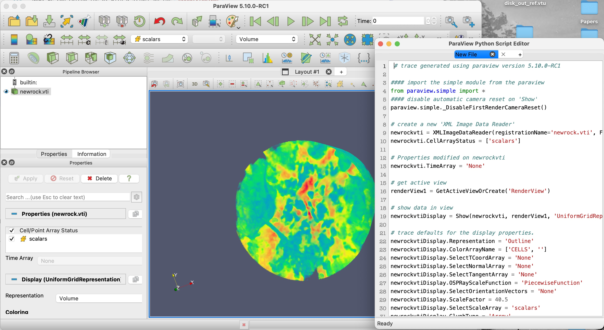

# ParaView

## Download ParaView

ParaView 5.10+ can be downloaded from [here](https://www.paraview.org/download).

## Virtual Environment

ParaView comes with its own Python, which may be missing some dependencies for the desired usage.
We can add more Python packages into ParaView by create a virtual environment and activate it inside your application using that import line `from paraview.web import venv` or by using our [local version](https://github.com/Kitware/trame/blob/master/examples/ParaView/venv.py) and importing it.


**First**, we need to setup the ParaView add-on python environment, which we will only install ***trame***, but we could add any other Python libraries that are not included in the ParaView bundle.

```bash
python3.9 -m venv .pvenv
source ./.pvenv/bin/activate
python -m pip install --upgrade pip
pip install "trame"
deactivate
```

**Note:**
 - We can not use our virtual environment with a `vtk` as our `vtk` library will conflict with the one inside Paraview.
 - Since ParaView includes `vtk`, any VTK example can be run with ParaView assuming the proper code is used to handle the virtual-env loading to get ***trame*** inside our Python script.

## Making ***trame*** available in ParaView

At the very top of our scripts, we need to import our helper script so the `--venv path/to/venv` can be processed.

```python
from paraview.web import venv
```

After that we can import ***trame*** and start using it (assuming we run our application with the `--venv /path/to/venv/with/trame` argument).

## Running an example

The command line below illustrate how a SimpleCone example can be run on a **Mac** computer where ParaView 5.10 has been installed.

```bash
/Applications/ParaView-5.10.0-RC1.app/Contents/bin/pvpython \
    ./05_paraview/SimpleCone.py  \
    --venv .pvenv
```


## Understanding this ParaView example

ParaView use proxies which abstracts the VTK object handling so they can be easily distributed for very large datasets.

For simplified usage, ParaView provides a `simple` package that lets us ***simply*** create and interact with these proxies. The `SimpleCone.py` example provides the core concepts needed to understand how to work with ParaView.


```python
from paraview import simple

cone = simple.Cone()               # Create a source (reader, filter...)
representation = simple.Show(cone) # Create a representation in a view (if no view, one is created)
view = simple.Render()             # Ask to compute image of active view and return the corresponding view
```

With these three lines, we create a full pipeline and a view. Now, we can use ***trame*** to show that view in the client.

```python
from trame.html import vuetify, paraview
from trame.layouts import SinglePage

html_view = paraview.VtkRemoteView(view)   # For remote rendering
# html_view = paraview.VtkLocalView(view)  # For local rendering

layout = SinglePage("ParaView cone", on_ready=html_view.update)

with layout.content:
    vuetify.VContainer(
        fluid=True,
        classes="pa-0 fill-height",
        children=[html_view],
    )
```

<div class="print-break"></div>

The rest of the code looks very similar to the VTK Hello ***trame*** example, but instead of importing the `vtk` module of ***trame***

```python
from trame.html import vuetify, vtk
```

we import the `paraview` module

```python
from trame.html import vuetify, paraview
```

## GUI

Now we can start adding some UI to control some of the parameters that we want to interact with dynamically.
Let's add a slider to control the resolution of the cone. We need to create a method to react when the `resolution` is changed by the slider. In ParaView proxies, object parameters are simple properties that can be get or set in a transparent manner. At this point, we simply need to update the `cone.Resolution` and update the view to see the change.

```python
@state.change("resolution")
def update_cone(resolution, **kwargs):
    cone.Resolution = resolution
    html_view.update()
```

Now, we can extend the UI with a slider on the `layout.toolbar`

```python
DEFAULT_RESOLUTION = 6

with layout.toolbar:
    vuetify.VSlider(
        v_model=("resolution", DEFAULT_RESOLUTION),
        min=3,
        max=60,
        step=1,
        hide_details=True,
        dense=True,
    )
```

With these few lines, we have created a 3D cone, which we can adjust the resolution all leveraging ParaView.

To learn more about ParaView scripting, you should look into ParaView trace which let you convert your UI interaction into actual Python code that can then be reused in your application.

<center>

</center>

<div class="print-break"></div>

## Advanced example

With the basics in place, we can now dive further in by using some built-in features of ParaView, such as saving and loading a state file. State files are a convinient way of capturing all the settings that were used to generate a visualization with Paraview.


Let's analyse the example in `./05_paraview/StateLoader.py`. The ***trame*** core of the example is as follows

**Script Header**

```python
import venv

import os
import trame
from trame.html import vuetify, paraview
from trame.layouts import SinglePage

from paraview import simple
```

**Script Core**

The rest of the script we've seen before, but we are missing the details of the `load_data` function.

```python
def load_data():
    pass # I'll explain later

layout = SinglePage("State Viewer", on_ready=load_data)
layout.logo.click = "$refs.view.resetCamera()"
layout.title.set_text("ParaView State Viewer")
layout.content.add_child(vuetify.VContainer(fluid=True, classes="pa-0 fill-height"))

if __name__ == "__main__":
    layout.start()
```

<div class="print-break"></div>

**`load_data`**

The `load_data()` function requires us to code the follow

1. Process a `--data` argument that contains the path to the file to load
2. Load the provided file path as a state file.
3. Create a view element and connect it to the view defined in the state
4. Add that view element into the content of our UI

**Process CLI argument `--data`**

The (1) is achieved with the following set of lines. More information on CLI are available [here](https://kitware.github.io/trame/docs/howdoi-cli.html).

```python
parser = trame.get_cli_parser()
parser.add_argument("--data", help="Path to state file", dest="data")
args, _ = parser.parse_known_args()

full_path = os.path.abspath(args.data)
working_directory = os.path.dirname(full_path)
```

**Load the state file**

To achieve (2) with ParaView the following set of lines are needed. ParaView trace should be able to explain the magic using the UI and looking at the corresponding Python code.


```python
simple.LoadState(
    full_path,
    data_directory=working_directory,
    restrict_to_data_directory=True,
)
view = simple.GetActiveView()
view.MakeRenderWindowInteractor(True)
```

**Create and Connect a view element**

Then (3) is similarly as before for VTK.

```python
html_view = paraview.VtkRemoteView(view)
```

**Add view element to UI**

Finally (4) is achieved with the following set of lines, the same way it was achieved with VTK in ***trame*** when switching from remote to local rendering.

```python
layout.content.children[0].add_child(html_view)
layout.flush_content()
```

That's it. You now have a ParaView `trame` application that let you reproduce complex visualization in a web context.

<center>


</center>

<div class="print-break"></div>

## Running the StateLoader

```bash
/Applications/ParaView-5.10.0-RC1.app/Contents/bin/pvpython \
    ./05_paraview/StateLoader.py  \
    --venv .pvenv \
    --data ./data/pv-state-diskout.pvsm
# or
/Applications/ParaView-5.10.0-RC1.app/Contents/bin/pvpython \
    ./05_paraview/StateLoader.py  \
    --venv .pvenv \
    --data ./data/pv-state.pvsm
```

Your browser should open automatically to `http://localhost:1234/`


<center>


</center>