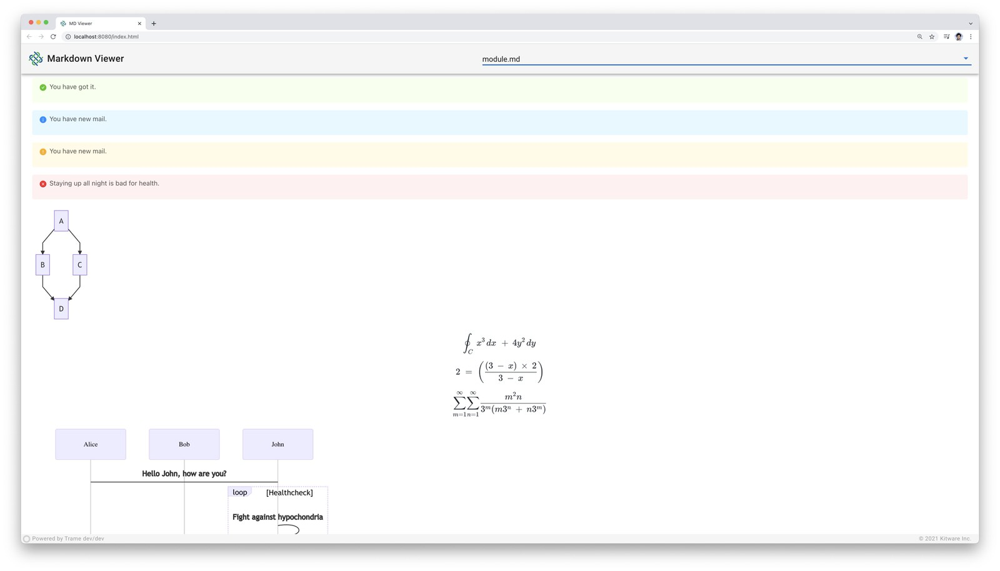
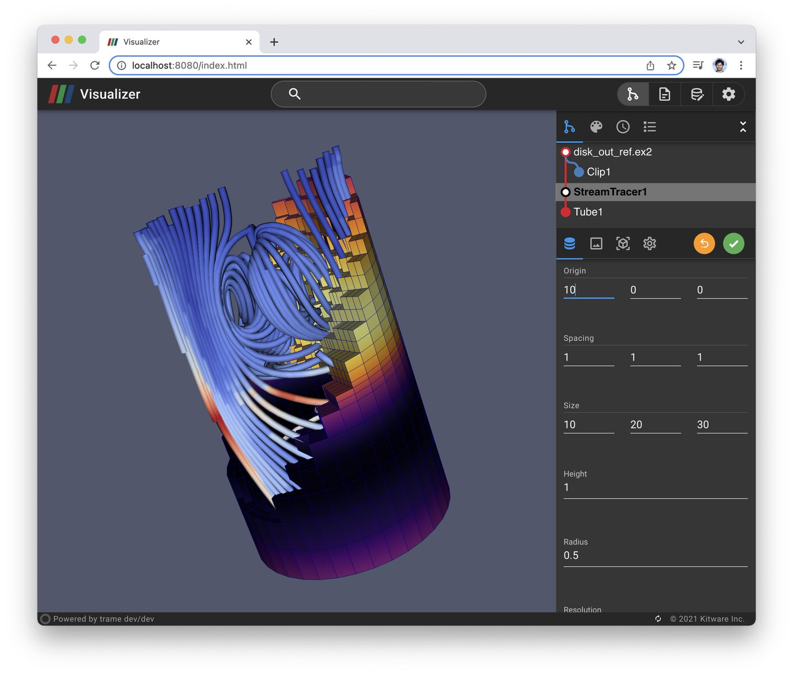
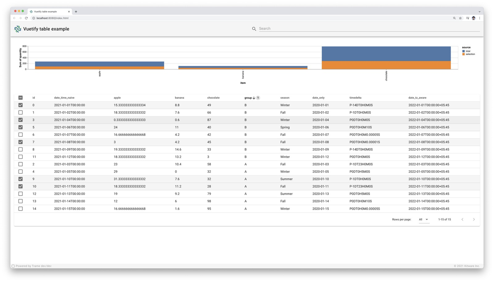

|            |      |      |
| :-------------------------------------------: | :-------------------------------------------: | :-------------------------------------------: | 
|  |        |            |
|               |  |     |
|                  |            |          |
|            |      |          |
|    |  |        |
|          |             |          |
|                 |   |    |
|    |       |            |
|   |  |                  |
|            |         |        |
|        |    |                  |
