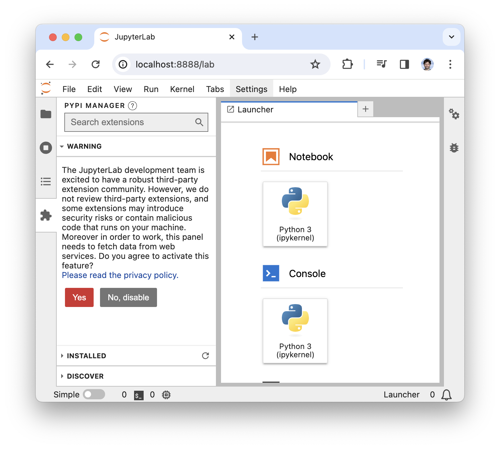
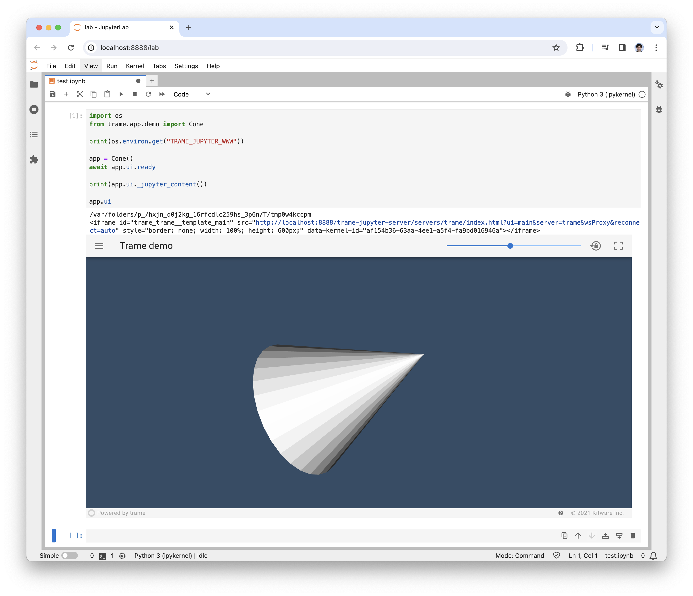

# trame-jupyter-extension

The trame-jupyter-extension as opposed to server proxy will use the existing WebSocket connection to exchange data between the kernel and the client and serve the HTML content from the Jupyter web server.

For __Jupyter Lab v3__, you must use the __"trame-jupyter-extension<2"__, while Jupyter Lab v4 will work with the latest version of the extension. 

You can install the extension by running `pip install trame-jupyter-extension` or via the __conda-forge__ channel.

## Installation & validation steps

### Setup your Jupyter Lab environment

::: code-group
<<< @/guide/jupyter/tests/conda.sh
<<< @/guide/jupyter/tests/py39.sh
<<< @/guide/jupyter/tests/py310.sh
<<< @/guide/jupyter/tests/py311.sh
<<< @/guide/jupyter/tests/py312.sh
:::

### Enable extensions


|  |  |
| :---: | :---: |
| (1) Accept warning | (2) Extension in Installed list |

### Testing code

::: code-group
<<< @/guide/jupyter/tests/test.py
<<< @/guide/jupyter/tests/test.ipynb
:::

The printed output should show that __TRAME_JUPYTER_WWW__ exist and that the __iframe(src=)__ use the same port as the Jupyter Lab server using a path like `/trame-jupyter-server/servers/...`.




## Advanced Debugging Checklist

While the extension should just work, sometime things are not easy. This section, focus on the various steps needed to ensure that everything is a expected.

1. The extension must be installed on the Jupyter Lab Server (not the kernel). 
    - __Test__: In the browser, open the "Dev tools", and check if `trameJupyter` is available in the console.
    - __TroubleShoot__
        - Extension not available in python `=> pip install correct version`
        - Extension not enabled in the Web UI
1. Make sure the extension properly configured the Kernel
    - __Test__: In a Python cell the environment variable should not be empty
    ```python
    import os
    print(os.environ.get("TRAME_JUPYTER_WWW"))
    ```
    - __TroubleShoot__
        - Plugin failed to activate `=> ??`
1. Make sure the iframe_builder use the extension resolver
    - __Test__: In a Python cell run the following command and inspect the URL
    ```python
    app.ui._jupyter_content()
    ```
    - __TroubleShoot__
        - Plugin failed to activate `=> ??`
        - Someone override the iframe_builder?
