# Application

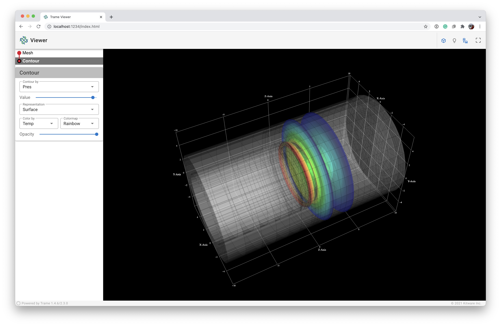

In the following we will create a more complete example application to demonstrate how to use several parts the ***trame*** library. Developing a trame application requires the following coding steps:

1. [Imports](#imports-id) for appropriate ***trame*** and vtk modules
2. Create the necessary [VTK pipelines](#vtk_pipeline-id)
3. Build [***trame*** Views](#trame_view-id)
4. Define the the [GUI](#gui-id) components required for interaction
5. Develop the [callbacks](#callbacks-id) for the GUI components
6. [Start](#start-id) the application

We will start by editing `04_application/app.py` which contain the basic structure of a **trame** app with the VTK rendering code base.

<div class="print-break"></div>
<a id="imports-id"></a>

## Imports

**First**, our ***trame*** imports have also changed. Thus, we will replace

```python
from trame.layouts import SinglePage
from trame.html import vtk, vuetify
```

with

```python
from trame.app import get_server
from trame.ui.vuetify import SinglePageLayout
from trame.widgets import vtk, vuetify, trame
```

We are creating a single page application with a drawer (`trame.ui.vuetify`), and we want to use one of ***trame***'s predefined widgets (`trame.widgets`) for displaying and interacting with visualization pipelines.

**Finally**, our VTK pipelines are fairly straight forward, but not available as one of the VTK examples. We will add the import for our VTK objects.

```python
from vtkmodules.vtkCommonDataModel import vtkDataObject
from vtkmodules.vtkFiltersCore import vtkContourFilter
from vtkmodules.vtkIOXML import vtkXMLUnstructuredGridReader
from vtkmodules.vtkRenderingAnnotation import vtkCubeAxesActor
```
to create a three-dimensional (3D) mesh, a contour, and a cube axes legend to outline the computational domain.

<a id="vtk_pipeline-id"></a>

## VTK Pipelines

**First**, we read the data using the `vtkXMLUnstructuredGridReader` and the full file path, provided by adding `CURRENT_DIRECTORY` to the beginning of the relative file path.

```python
# Read Data
reader = vtkXMLUnstructuredGridReader()
reader.SetFileName(os.path.join(CURRENT_DIRECTORY, "../data/disk_out_ref.vtu"))
reader.Update()
```

<div class="print-break"></div>

**Second**, we determine the available data arrays and build an array of dictionaries, `dataset_arrays` that contains the array name, value or id, range, and type (point or cell data). We also define the default array and the default minimum and maximum of the default array.

```python
# Extract Array/Field information
dataset_arrays = []
fields = [
    (reader.GetOutput().GetPointData(), vtkDataObject.FIELD_ASSOCIATION_POINTS),
    (reader.GetOutput().GetCellData(), vtkDataObject.FIELD_ASSOCIATION_CELLS),
]
for field in fields:
    field_arrays, association = field
    for i in range(field_arrays.GetNumberOfArrays()):
        array = field_arrays.GetArray(i)
        array_range = array.GetRange()
        dataset_arrays.append(
            {
                "text": array.GetName(),
                "value": i,
                "range": list(array_range),
                "type": association,
            }
        )
default_array = dataset_arrays[0]
default_min, default_max = default_array.get("range")
```

The `dataset_arrays` and defaults are used in several places of the initial pipelines, but we plan to enable switching between the available arrays for coloring and contouring.

**Third**, we create the *mesh* pipeline, which is simply a `vtkDataSetMapper` and a `vtkActor` that we add to the `renderer`.

```python
# Mesh
mesh_mapper = vtkDataSetMapper()
mesh_mapper.SetInputConnection(reader.GetOutputPort())
mesh_actor = vtkActor()
mesh_actor.SetMapper(mesh_mapper)
renderer.AddActor(mesh_actor)
```

We want to be able to change the mesh representation, so we get a handle on the `mesh_actor` property and set the representation to surface, set the default point size, and turn off edge visibility.

```python
# Mesh: Setup default representation to surface
mesh_actor.GetProperty().SetRepresentationToSurface()
mesh_actor.GetProperty().SetPointSize(1)
mesh_actor.GetProperty().EdgeVisibilityOff()
```

We also want to be able to change the mesh color map, so we get a handle on the mesh's color lookup table and set the hue, saturation, and value ranges to create a rainbow color map, and build it.

```python
# Mesh: Apply rainbow color map
mesh_lut = mesh_mapper.GetLookupTable()
mesh_lut.SetHueRange(0.666, 0.0)
mesh_lut.SetSaturationRange(1.0, 1.0)
mesh_lut.SetValueRange(1.0, 1.0)
mesh_lut.Build()
```

We finally want to be able to change how to color the array or field data, so we retrieve a handle on the mesh's mapper and set the array to color by and the range of the array to the defaults, tell the mapper to use the appropriate scalar mode for the array, turn on the scalar visibility, and tell the mapper to use the scalar range assigned to the lookup table.

<div class="print-break"></div>

```python
# Mesh: Color by default array
mesh_mapper.SelectColorArray(default_array.get("text"))
mesh_mapper.GetLookupTable().SetRange(default_min, default_max)
if default_array.get("type") == vtkDataObject.FIELD_ASSOCIATION_POINTS:
    mesh_mapper.SetScalarModeToUsePointFieldData()
else:
    mesh_mapper.SetScalarModeToUseCellFieldData()
mesh_mapper.SetScalarVisibility(True)
mesh_mapper.SetUseLookupTableScalarRange(True)
```

**Fourth**, we create the *contour* pipeline, which uses a `vtkContourFilter`, a `vtkDataSetMapper`, and a `vtkActor` that we add to the `renderer`.

```python
# Contour
contour = vtkContourFilter()
contour.SetInputConnection(reader.GetOutputPort())
contour_mapper = vtkDataSetMapper()
contour_mapper.SetInputConnection(contour.GetOutputPort())
contour_actor = vtkActor()
contour_actor.SetMapper(contour_mapper)
renderer.AddActor(contour_actor)
```

We want to be able to change the array or field to contour by, so we define the initial value as the midpoint between the default minimum and maximum of the default array, set the default array as the input array, and set the computed contour value.

```python
# Contour: ContourBy default array
contour_value = 0.5 * (default_max + default_min)
contour.SetInputArrayToProcess(
    0, 0, 0, default_array.get("type"), default_array.get("text")
)
contour.SetValue(0, contour_value)
```

We want to be able to change the contour representation, the contour color map, and the array to color by, so we initialize these defaults as we did for the *mesh* pipeline.

```python
# Contour: Setup default representation to surface
contour_actor.GetProperty().SetRepresentationToSurface()
contour_actor.GetProperty().SetPointSize(1)
contour_actor.GetProperty().EdgeVisibilityOff()

# Contour: Apply rainbow color map
contour_lut = contour_mapper.GetLookupTable()
contour_lut.SetHueRange(0.666, 0.0)
contour_lut.SetSaturationRange(1.0, 1.0)
contour_lut.SetValueRange(1.0, 1.0)
contour_lut.Build()

# Contour: Color by default array
contour_mapper.SelectColorArray(default_array.get("text"))
contour_mapper.GetLookupTable().SetRange(default_min, default_max)
if default_array.get("type") == vtkDataObject.FIELD_ASSOCIATION_POINTS:
    contour_mapper.SetScalarModeToUsePointFieldData()
else:
    contour_mapper.SetScalarModeToUseCellFieldData()
contour_mapper.SetScalarVisibility(True)
contour_mapper.SetUseLookupTableScalarRange(True)
```

**Fifth**, we create the cube axes, which is a `vtkCubeAxesActor` that we add to the `renderer`.

```python
# Cube Axes
cube_axes = vtkCubeAxesActor()
renderer.AddActor(cube_axes)
```

The `vtkCubeAxesActor` requires initialization by the bounds of the domain and the `renderer` camera.

```python
# Cube Axes: Boundaries, camera, and styling
cube_axes.SetBounds(mesh_actor.GetBounds())
cube_axes.SetCamera(renderer.GetActiveCamera())
cube_axes.SetXLabelFormat("%6.1f")
cube_axes.SetYLabelFormat("%6.1f")
cube_axes.SetZLabelFormat("%6.1f")
cube_axes.SetFlyModeToOuterEdges()
```

**Finally**, we reset the `renderer` camera to initialize the view.

```python
renderer.ResetCamera()
```

<div class="print-break"></div>
<a id="trame_view-id"></a>

## ***trame*** Views

For this application, we want to enable dynamic switching between *local* and *remote* rendering. Thus, we will be using `vtk.VtkRemoteLocalView` which internally manage a *local* and *remote* ***trame*** view.

**Note**: The `interactive_ratio` implies the desired image reduction fraction to enhance the frames per second during interaction. Here we set it to 1, which means the image will not be reduced.

<a id="gui-id"></a>

## GUI

We are creating a single page application with a drawer using `SinglePageWithDrawer`. By default we get a title, toolbar, drawer, and a content section. So we instantiate a `SinglePageWithDrawer` with the `title` of "Viewer" and `on_ready` argument equal to `html_view.update`, which updates the three-dimensional visualization.

```python
with SinglePageWithDrawerLayout(server) as layout:
    layout.title.set_text("Viewer")

    with layout.toolbar:
        # toolbar components
        pass

    with layout.drawer as drawer:
        # drawer components
        pass

    with layout.content:
        # content components
        with vuetify.VContainer(
            fluid=True,
            classes="pa-0 fill-height",
        ):
            view = vtk.VtkRemoteLocalView(renderWindow, namespace="view", mode="local", interactive_ratio=1)
            ctrl.view_update = view.update              # capture view update method
            ctrl.view_reset_camera = view.reset_camera  # capture view reset_camera method
```

**Note**: The `layout.drawer as drawer` syntax is used to get a reference to the drawer to set some of the drawer's properties.

<div class="print-break"></div>
<a id="gui_toolbar-id"></a>

### Toolbar GUI

<p style="text-align:center;">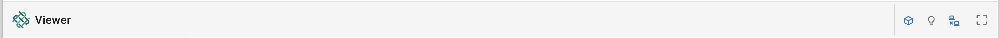</p>

We want to create a toolbar with the application logo and title on one end and some standard buttons separated by a vertical divider on the other end. The `VSpacer` is used to push the content the right-side of the application toolbar, and the `VDivider` is used to create the vertical divider, and method `standard_buttons` encapsulates the GUI code to produce these buttons.

```python
with layout.toolbar:
    # toolbar components
    vuetify.VSpacer()
    vuetify.VDivider(vertical=True, classes="mx-2")
    standard_buttons()
```

<p style="text-align:center;">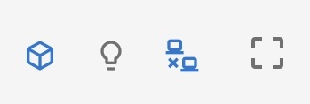</p>

Three of the buttons have on/off states, so we will use a `VCheckbox` with the `on_icon` and `off_icon` properties and the `v_model` callback to switch between these states. The `resetCamera` button is just using the controller function to allow out-of-order initialization.

```python
def standard_buttons():
    vuetify.VCheckbox(
        v_model=("cube_axes_visibility", True),
        on_icon="mdi-cube-outline",
        off_icon="mdi-cube-off-outline",
        classes="mx-1",
        hide_details=True,
        dense=True,
    )
    vuetify.VCheckbox(
        v_model="$vuetify.theme.dark",
        on_icon="mdi-lightbulb-off-outline",
        off_icon="mdi-lightbulb-outline",
        classes="mx-1",
        hide_details=True,
        dense=True,
    )
    vuetify.VCheckbox(
        v_model=("viewMode", "local"), # VtkRemoteLocalView => {namespace}Mode=['local', 'remote']
        on_icon="mdi-lan-disconnect",
        off_icon="mdi-lan-connect",
        true_value="local",
        false_value="remote",
        classes="mx-1",
        hide_details=True,
        dense=True,
    )
    with vuetify.VBtn(icon=True, click=ctrl.view_reset_camera):
        vuetify.VIcon("mdi-crop-free")
```

The `dark` checkbox is as the previous examples using built-in *Vuetify* (`$vuetify.theme.dark`) reactive variable.

The `viewMode` checkbox is used to switch between the *local* and *remote* rendering, and leverages the `VtkRemoteLocalView` mode. The `cube_axes_visibility` checkbox is used to turn on and off the cube axes, and leverages the [`cube_axes_visibility` callback](#toolbar_callbacks_cube_axes_visibility-id).

<a id="gui_drawer-id"></a>

### Drawer GUI

<p style="text-align:center;">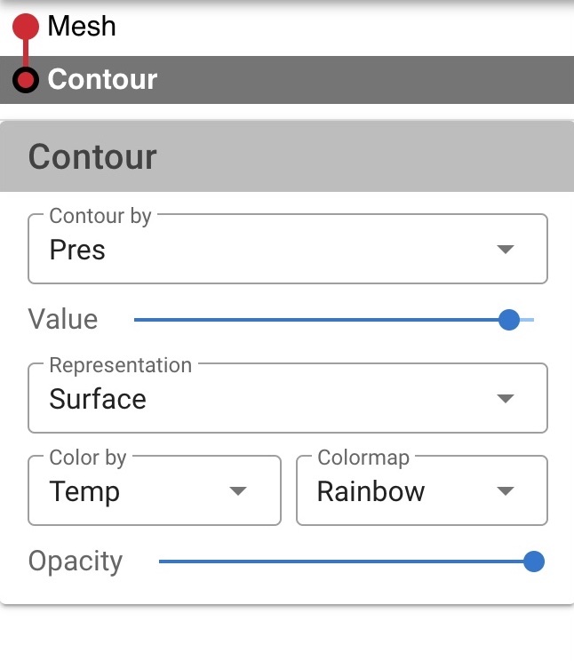</p>

We want to create a drawer with the ***trame*** pipeline widget, a horizontal divider, and pipeline cards. The pipeline cards are shown corresponding to the selected pipeline in the ***trame*** pipeline widget. We need create state for the active pipeline card, so we add this to the shared state that can be updated on the state directly.

```python
# State use to track active UI card
state.setdefault("active_ui", None) # prevent resetting value if already present
```

We want a little wider `drawer`, so we set the width to 325 pixels. Next, we add the ***trame*** pipeline widget using the `pipeline_widget` function. Then, we use a `VDivider` to separate the ***trame*** widget from the pipeline cards. Finally, we add the pipeline cards using the `mesh_card` and `contour_card` functions.

```python
with layout.drawer as drawer:
    # drawer components
    drawer.width = 325
    pipeline_widget()
    vuetify.VDivider(classes="mb-2")
    mesh_card()
    contour_card()
```

<a id="pipeline_widget-id"></a>

#### Pipeline Widget

<p style="text-align:center;">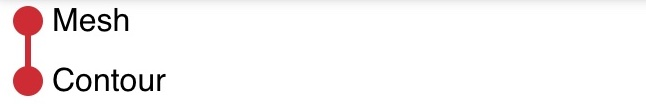</p>

The ***trame*** widgets are easy to use. Here, we simply create the widget, define the pipelines and their relationships, and define references to the pipeline widgets two callback functions.

```python
def pipeline_widget():
    widgets.GitTree(
        sources=(
            "pipeline",
            [
                {"id": "1", "parent": "0", "visible": 1, "name": "Mesh"},
                {"id": "2", "parent": "1", "visible": 1, "name": "Contour"},
            ],
        ),
        actives_change=(actives_change, "[$event]"),
        visibility_change=(visibility_change, "[$event]"),
    )
```

<div class="print-break"></div>
<a id="default_ui_card-id"></a>

#### Default `ui_card`

<p style="text-align:center;"></p>

The default GUI card is a simple card with a title, and a body. The card itself is shown (`v_show`) if the `ui_name` is the same as `active_ui`. We use the `VCard` to create the card, and the `VCardTitle` to create the card title, and the `VCardText` to create the space to add individual pipeline GUI components. The stylings for the card colors can be found at [Material Design](https://materializecss.com/color.html).

```python
def ui_card(title, ui_name):
    with vuetify.VCard(v_show=f"active_ui == '{ui_name}'"):
        vuetify.VCardTitle(
            title,
            classes="grey lighten-1 py-1 grey--text text--darken-3",
            style="user-select: none; cursor: pointer",
            hide_details=True,
            dense=True,
        )
        content = vuetify.VCardText(classes="py-2")
    return content
```

<a id="mesh_card-id"></a>

#### `mesh_card`

<p style="text-align:center;">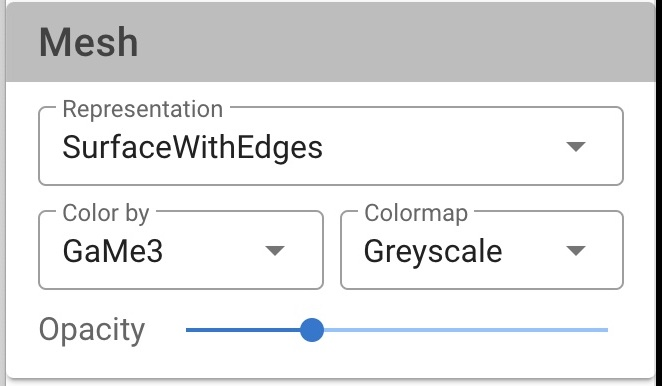</p>

The `mesh_card` contains strictly default GUI components of a pipeline. First, a dropdown menu for the visual [representation](#gui_representation-id) type. Next, a row with two columns. One contains a dropdown menu for the array/field to [color by](#gui_color_by-id), and the other a dropdown menu for which [color map](#gui_color_map-id) to use. Finally, a slider to control the [opacity](#gui_opacity-id).

```python
def mesh_card():
    with ui_card(title="Mesh", ui_name="mesh"):
        vuetify.VSelect(
            # Representation
        )
        with vuetify.VRow(classes="pt-2", dense=True):
            with vuetify.VCol(cols="6"):
                vuetify.VSelect(
                    # Color By
                )
            with vuetify.VCol(cols="6"):
                vuetify.VSelect(
                    # Color Map
                )
        vuetify.VSlider(
            # Opacity
        )
```

Since these are default pipeline elements, we will cover these items together with the contour_card individual components [below](#default_components-id).

<div class="print-break"></div>
<a id="contour_card-id"></a>

#### `contour_card`

<p style="text-align:center;">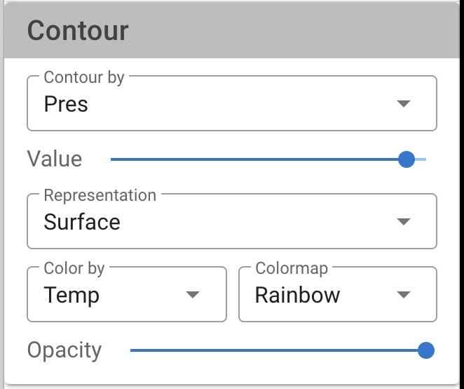</p>

The `contour_card` contains a dropdown menu to select the array/field to [contour by](#contour-by-gui), a slider to control the [contour value](#contour-value-gui), and the default GUI components of a pipeline.

```python
def contour_card():
    with ui_card(title="Contour", ui_name="contour"):
        vuetify.VSelect(
            # Contour By
        )
        vuetify.VSlider(
            # Contour Value
        )
   *    vuetify.VSelect(
   *        # Representation
   *    )
   *    with vuetify.VRow(classes="pt-2", dense=True):
   *        with vuetify.VCol(cols="6"):
   *            vuetify.VSelect(
   *                # Color By
   *            )
   *        with vuetify.VCol(cols="6"):
   *            vuetify.VSelect(
   *                # Color Map
   *            )
   *    vuetify.VSlider(
   *        # Opacity
   *    )
```

For simplicity, we will cover these items the contour individual components [below](#contour_components-id).

**Note**: `*` denotes essentially duplicate code\components from the `mesh_card`.

<a id="default_components-id"></a>

#### Default Components

The default components of a pipeline include the [representation](#gui_representation-id) selection, the [color by](#gui_color_by-id) selection, the [color map](#gui_color_map-id) selection, and the [opacity](#gui_opacity-id) slider.

<div class="print-break"></div>
<a id="gui_representation-id"></a>

##### Representation GUI

First, we create a constant class `Representation` to enumerate the different representations.

```python
class Representation:
    Points = 0
    Wireframe = 1
    Surface = 2
    SurfaceWithEdges = 3
```

<p style="text-align:center;">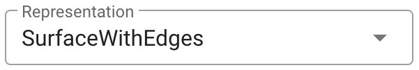</p>

Second, we create a dropdown menu for the representation type. The `VSelect` component is used to create a dropdown menu. The `v_model` uses the state variable `mesh_representation` initialized to be a surface. The `items` is a list of tuples, where the first element is the display string (`text`) of the representation, and the second element is the value of the representation used for selection.

```python
        vuetify.VSelect(
            # Representation
            v_model=("mesh_representation", Representation.Surface),
            items=(
                "representations",
                [
                    {"text": "Points", "value": 0},
                    {"text": "Wireframe", "value": 1},
                    {"text": "Surface", "value": 2},
                    {"text": "SurfaceWithEdges", "value": 3},
                ],
            ),
            label="Representation",
            hide_details=True,
            dense=True,
            outlined=True,
            classes="pt-1",
        )
```

The [`update_mesh_representation`](#drawer_callbacks_update_mesh_representation-id) callback is used to update the representation of the mesh.

The dropdown menu for the representation type for the contour pipeline is similar to the mesh pipeline, but replace the `v_model` line with the `v_model` line for the contour pipeline.

```python
        vuetify.VSelect(
            # Representation
            v_model=("contour_representation", Representation.Surface),
            # ... same as mesh ...
```

The [`update_contour_representation`](#drawer_callbacks_update_contour_representation-id) callback is used to update the representation of the contour.

<div class="print-break"></div>
<a id="gui_color_by-id"></a>

##### Color By GUI

<p style="text-align:center;">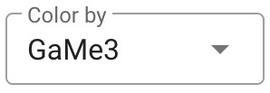</p>

We create a dropdown menu for the color by. The `VSelect` component is used to create the dropdown menu. The `v_model` uses the state variable `mesh_color_array_idx` initialized to be the default_array, 0. The `items` is a list of tuples, where the first element is the display string (`text`) of the array name, and the second element is the value of the array used for selection. For `items`, we use the state variable `array_list` to create the list of arrays initialized by our `dataset_arrays` array of dictionaries we created at read time.

```python
                vuetify.VSelect(
                    # Color By
                    label="Color by",
                    v_model=("mesh_color_array_idx", 0),
                    items=("array_list", dataset_arrays),
                    hide_details=True,
                    dense=True,
                    outlined=True,
                    classes="pt-1",
                )
```

The [`update_mesh_color_by_name`](#drawer_callbacks_update_mesh_color_by_name-id) callback is used to update the color by array of the mesh.

The dropdown menu for the color by of the contour pipeline is similar to the mesh pipeline, but replace the `v_model` line with the `v_model` line for the contour pipeline.

```python
                vuetify.VSelect(
                    # Color By
                    v_model=("contour_color_array_idx", 0),
                    # ... same as mesh ...
```

The [`update_contour_representation`](#drawer_callbacks_update_contour_color_by_name-id) callback is used to update the color by array of the contour.

<div class="print-break"></div>
<a id="gui_color_map-id"></a>

##### Color Map GUI

First, we create a constant class `LookupTable` to enumerate the different color maps.

```python
class LookupTable:
    Rainbow = 0
    Inverted_Rainbow = 1
    Greyscale = 2
    Inverted_Greyscale = 3
```

<p style="text-align:center;">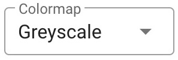</p>

Second, we create a dropdown menu for the color map. The `VSelect` component is used to create a dropdown menu. The `v_model` uses the state variable `mesh_color_preset` initialized to be the rainbow color map. The `items` is a list of tuples, where the first element is the display string (`text`) of the color map, and the second element is the value of the color map used for selection.

```python
                vuetify.VSelect(
                    # Color Map
                    label="Colormap",
                    v_model=("mesh_color_preset", LookupTable.Rainbow),
                    items=(
                        "colormaps",
                        [
                            {"text": "Rainbow", "value": 0},
                            {"text": "Inv Rainbow", "value": 1},
                            {"text": "Greyscale", "value": 2},
                            {"text": "Inv Greyscale", "value": 3},
                        ],
                    ),
                    hide_details=True,
                    dense=True,
                    outlined=True,
                    classes="pt-1",
                )
```

The [`update_mesh_color_preset`](#drawer_callbacks_update_mesh_color_preset-id) callback is used to update the color map of the mesh.

The dropdown menu for the color map of the contour pipeline is similar to the mesh pipeline, but replace the `v_model` line with the `v_model` line for the contour pipeline.

```python
                vuetify.VSelect(
                    # Color Map
                    v_model=("contour_color_preset", LookupTable.Rainbow),
                    # ... same as mesh ...
```

The [`update_contour_color_preset`](#drawer_callbacks_update_contour_color_preset-id) callback is used to update the color map of the contour.

<div class="print-break"></div>
<a id="gui_opacity-id"></a>

##### Opacity GUI

<p style="text-align:center;">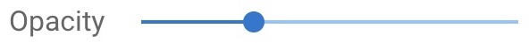</p>

We create a slider for the opacity. The `VSlider` component is used to create the slider. The `v_model` uses the state variable `mesh_opacity` initialized to 1.0. The `min` is set to 0 and the `max` is set to 1. The `step` is set to 0.1.

```python
        vuetify.VSlider(
            # Opacity
            v_model=("mesh_opacity", 1.0),
            min=0,
            max=1,
            step=0.1,
            label="Opacity",
            classes="mt-1",
            hide_details=True,
            dense=True,
        )
```

The [`update_mesh_opacity`](#drawer_callbacks_update_mesh_opacity-id) callback is used to update the color map of the mesh.

The slider for the opacity of the contour pipeline is similar to the mesh pipeline, but replace the `v_model` line with the `v_model` line for the contour pipeline.

```python
        vuetify.VSlider(
            # Opacity
            v_model=("contour_opacity", 1.0),
            # ... same as mesh ...
```

The [`update_contour_opacity`](#drawer_callbacks_update_contour_opacity-id) callback is used to update the opacity of the contour.

<a id="contour_components-id"></a>

#### Contour Components

<a id="gui_contour_by-id"></a>

##### Contour By GUI

<p style="text-align:center;"></p>

We create a dropdown menu for the contour by. The `VSelect` component is used to create the dropdown menu. The `v_model` uses the state variable `contour_by_array_idx` initialized to be the default_array, 0. The `items` is a list of tuples, where the first element is the display string (`text`) of the array name, and the second element is the value of the array used for selection. For `items`, we use the state variable `array_list` to create the list of arrays initialized by our `dataset_arrays` array of dictionaries we created at read time.

```python
        vuetify.VSelect(
            # Contour By
            label="Contour by",
            v_model=("contour_by_array_idx", 0),
            items=("array_list", dataset_arrays),
            hide_details=True,
            dense=True,
            outlined=True,
            classes="pt-1",
        )
```

The [`update_contour_by`](#drawer_callbacks_update_contour_by-id) callback is used to update the contour by array of the contour.

<a id="gui_contour_value-id"></a>

##### Contour Value GUI

We create a slider for the contour value. The `VSlider` component is used to create the slider. The `v_model` uses the state variable `contour_value` initialized to mid-point of the selected contour by array. The `min` is set to minimum of the contour by array and the `max` is set to maximum of the contour by array. The `step` is set to 0.01 times the range of the contour by array.

<p style="text-align:center;">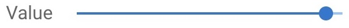</p>

```python
        vuetify.VSlider(
            # Contour Value
            v_model=("contour_value", contour_value),
            min=("contour_min", default_min),
            max=("contour_max", default_max),
            step=("contour_step", 0.01 * (default_max - default_min)),
            label="Value",
            classes="my-1",
            hide_details=True,
            dense=True,
        )
```

The [`update_contour_value`](#drawer_callbacks_update_contour_value-id) callback is used to update the value of the contour.

<a id="callbacks-id"></a>

## Callbacks

<a id="toolbar_callbacks-id"></a>

### Toolbar Callbacks

The first toolbar callback is the `cube_axes_visibility` callback, which is used to turn on and off the cube axes. The `update_cube_axes_visibility` function is found by the @state.change decorator for `cube_axes_visibility`. Then we simply set the `cube_axes` actor's `Visibility` property to the value of `cube_axes_visibility`, and update the view.

<a id="toolbar_callbacks_cube_axes_visibility-id"></a>

```python
@state.change("cube_axes_visibility")
def update_cube_axes_visibility(cube_axes_visibility, **kwargs):
    cube_axes.SetVisibility(cube_axes_visibility)
    ctrl.view_update()
```

<div class="print-break"></div>
<a id="drawer_callbacks-id"></a>

### Drawer Callbacks

   1. [Pipeline Widget Callbacks](#drawer_pipeline_widget_callbacks-id)
   2. [Representation Callbacks](#representation_callbacks-id)
   3. [Color By Callbacks](#color_by_callbacks-id)
   4. [Color Map Callbacks](#colormap_callbacks-id)
   5. [Opacity Callbacks](#opacity_callbacks-id)
   6. [Contour Components Callbacks](#contour_components-id)

<a id="drawer_pipeline_widget_callbacks-id"></a>

#### Pipeline Widget Callbacks

When a pipeline is selected in the pipeline widget, we want to update the pipeline card to show in the drawer. Using the default `actives_change` function of ***trame*** pipeline widget, we simply update the `state` element `active_ui` to display the pipeline card of the selected pipeline.

<a id="drawer_callbacks_actives_change-id"></a>

```python
# Selection Change
def actives_change(ids):
    _id = ids[0]
    if _id == "1":  # Mesh
        state.active_ui = "mesh"
    elif _id == "2":  # Contour
        state.active_ui = "contour"
    else:
        state.active_ui = "nothing"
```

When a pipeline visibility is toggled in the pipeline widget, we want to update the view to add or remove the toggled pipeline. Using the default `visibility_change` function of ***trame*** pipeline widget, we update the visibility of the appropriate pipeline `actor` using `actor.SetVisibility` function with the visibility accessed from the `event["visible"]` dictionary element.

<a id="drawer_callbacks_visibility_change-id"></a>

```python
# Visibility Change
def visibility_change(event):
    _id = event["id"]
    _visibility = event["visible"]

    if _id == "1":  # Mesh
        mesh_actor.SetVisibility(_visibility)
    elif _id == "2":  # Contour
        contour_actor.SetVisibility(_visibility)
    ctrl.view_update()
```

<a id="representation_callbacks-id"></a>

#### Representation Callbacks

The `update_representation` function updates the `representation` property of an `actor` to the value of `mode`.

<a id="drawer_callbacks_update_representation-id"></a>
<div class="print-break"></div>

```python
# Representation Callbacks
def update_representation(actor, mode):
    property = actor.GetProperty()
    if mode == Representation.Points:
        property.SetRepresentationToPoints()
        property.SetPointSize(5)
        property.EdgeVisibilityOff()
    elif mode == Representation.Wireframe:
        property.SetRepresentationToWireframe()
        property.SetPointSize(1)
        property.EdgeVisibilityOff()
    elif mode == Representation.Surface:
        property.SetRepresentationToSurface()
        property.SetPointSize(1)
        property.EdgeVisibilityOff()
    elif mode == Representation.SurfaceWithEdges:
        property.SetRepresentationToSurface()
        property.SetPointSize(1)
        property.EdgeVisibilityOn()
```

The `update_mesh_representation` function is found by the @state.change decorator for `mesh_representation`. We simply call the `update_representation` function with the `mesh_actor` and the `mesh_representation` state, and then update the view.

<a id="drawer_callbacks_update_mesh_representation-id"></a>

```python
@state.change("mesh_representation")
def update_mesh_representation(mesh_representation, **kwargs):
    update_representation(mesh_actor, mesh_representation)
    ctrl.view_update()
```

Likewise, the `update_contour_representation` function is found by the @state.change decorator for `contour_representation`. We simply call the `update_representation` function with the `mesh_actor` and the `contour_representation` state, and then update the view.

<a id="drawer_callbacks_update_contour_representation-id"></a>

```python
@state.change("contour_representation")
def update_contour_representation(contour_representation, **kwargs):
    update_representation(contour_actor, contour_representation)
    ctrl.view_update()
```

<a id="color_by_callbacks-id"></a>
<div class="print-break"></div>

#### Color By Callbacks

The `color_by_array` function updates the `SelectColorArray` of the `mapper` of an `actor` to the value of `array`. These operations are the same as the ones we used setting up the initial pipeline, so we will not go through the individual commands again here.

<a id="drawer_callbacks_color_by_array-id"></a>

```python
# Color By Callbacks
def color_by_array(actor, array):
    _min, _max = array.get("range")
    mapper = actor.GetMapper()
    mapper.SelectColorArray(array.get("text"))
    mapper.GetLookupTable().SetRange(_min, _max)
    if array.get("type") == vtkDataObject.FIELD_ASSOCIATION_POINTS:
        mesh_mapper.SetScalarModeToUsePointFieldData()
    else:
        mesh_mapper.SetScalarModeToUseCellFieldData()
    mapper.SetScalarVisibility(True)
    mapper.SetUseLookupTableScalarRange(True)
```

The `update_mesh_color_by_name` function is found by the @state.change decorator for `mesh_color_array_idx`. We simply call the `color_by_array` function with the `mesh_actor` and the `array`, and then update the view. The `array` is set using the `mesh_color_array_idx` state on the `dataset_arrays` array of dictionaries.

<a id="drawer_callbacks_update_mesh_representation-id"></a>

```python
@state.change("mesh_color_array_idx")
def update_mesh_color_by_name(mesh_color_array_idx, **kwargs):
    array = dataset_arrays[mesh_color_array_idx]
    color_by_array(mesh_actor, array)
    ctrl.view_update()
```

Likewise, the `update_contour_color_by_name` function is found by the @state.change decorator for `contour_color_array_idx`. We simply call the `color_by_array` function with the `contour_actor` and the `array`, and then update the view. The `array` is set using the `contour_color_array_idx` state on the `dataset_arrays` array of dictionaries.

<a id="drawer_callbacks_update_contour_color_by_name-id"></a>

```python
@state.change("contour_color_array_idx")
def update_contour_color_by_name(contour_color_array_idx, **kwargs):
    array = dataset_arrays[contour_color_array_idx]
    color_by_array(contour_actor, array)
    ctrl.view_update()
```

<a id="colormap_callbacks-id"></a>

#### Color Map Callbacks

The `use_preset` function updates the `lut`, lookup table,  hue, saturation, and value range for the `preset`. We need the `actor` to get the `lut`, and the `preset` to determine the `hue`, `saturation`, and `value_range`.

<a id="drawer_callbacks_use_preset-id"></a>

```python
# Color Map Callbacks
def use_preset(actor, preset):
    lut = actor.GetMapper().GetLookupTable()
    if preset == LookupTable.Rainbow:
        lut.SetHueRange(0.666, 0.0)
        lut.SetSaturationRange(1.0, 1.0)
        lut.SetValueRange(1.0, 1.0)
    elif preset == LookupTable.Inverted_Rainbow:
        lut.SetHueRange(0.0, 0.666)
        lut.SetSaturationRange(1.0, 1.0)
        lut.SetValueRange(1.0, 1.0)
    elif preset == LookupTable.Greyscale:
        lut.SetHueRange(0.0, 0.0)
        lut.SetSaturationRange(0.0, 0.0)
        lut.SetValueRange(0.0, 1.0)
    elif preset == LookupTable.Inverted_Greyscale:
        lut.SetHueRange(0.0, 0.666)
        lut.SetSaturationRange(0.0, 0.0)
        lut.SetValueRange(1.0, 0.0)
    lut.Build()
```

The `update_mesh_color_preset` function is found by the @state.change decorator for `mesh_color_preset`. We simply call the `use_preset` function with the `mesh_actor` and the `mesh_color_preset` state, and then update the view.

<a id="drawer_callbacks_update_mesh_color_preset-id"></a>

```python
@state.change("mesh_color_preset")
def update_mesh_color_preset(mesh_color_preset, **kwargs):
    use_preset(mesh_actor, mesh_color_preset)
    ctrl.view_update()
```

The `update_contour_color_preset` function is found by the @state.change decorator for `contour_color_preset`. We simply call the `use_preset` function with the `contour_actor` and the `contour_color_preset` state, and then update the view.

<a id="drawer_callbacks_update_contour_color_preset-id"></a>

```python
@state.change("contour_color_preset")
def update_contour_color_preset(contour_color_preset, **kwargs):
    use_preset(contour_actor, contour_color_preset)
    ctrl.view_update()
```

<a id="opacity_callbacks-id"></a>

#### Opacity Callbacks

The `update_mesh_opacity` function is found by the @state.change decorator for `mesh_opacity`. We simply use a `mesh_actor` property and the `mesh_opacity` state to `SetOpacity`, and then update the view.

<a id="drawer_callbacks_update_mesh_opacity-id"></a>

```python
# Opacity Callbacks
@state.change("mesh_opacity")
def update_mesh_opacity(mesh_opacity, **kwargs):
    mesh_actor.GetProperty().SetOpacity(mesh_opacity)
    ctrl.view_update()
```

The `update_contour_opacity` function is found by the @state.change decorator for `contour_opacity`. We simply use a `contour_actor` property and the `contour_opacity` state to `SetOpacity`, and then update the view.

<a id="drawer_callbacks_update_contour_opacity-id"></a>

```python
@state.change("contour_opacity")
def update_contour_opacity(contour_opacity, **kwargs):
    contour_actor.GetProperty().SetOpacity(contour_opacity)
    ctrl.view_update()
```

<a id="contour_callbacks-id"></a>

#### Contour Callbacks

The `update_contour_by` function updates the `SetInputArrayToProcess` of the `contour` filter to the value of `array`. These operations are the same as the ones we used setting up the initial pipeline, so we will not go through the individual commands again here.

<a id="drawer_callbacks_update_contour_by-id"></a>

```python
# Contour Callbacks
@state.change("contour_by_array_idx")
def update_contour_by(contour_by_array_idx, **kwargs):
    array = dataset_arrays[contour_by_array_idx]
    contour_min, contour_max = array.get("range")
    contour_step = 0.01 * (contour_max - contour_min)
    contour_value = 0.5 * (contour_max + contour_min)
    contour.SetInputArrayToProcess(0, 0, 0, array.get("type"), array.get("text"))
    contour.SetValue(0, contour_value)

    # Update UI
    state.contour_min = contour_min
    state.contour_max = contour_max
    state.contour_value = contour_value
    state.contour_step = contour_step

    # Update View
    ctrl.view_update()
```

the `update_contour_by` function is found by the @state.change decorator for `contour_by_array_idx`. We simply use the `contour` filter and the `array`, and then update the view. The `array` is set using the `contour_by_array_idx` state on the `dataset_arrays` array of dictionaries.

The `update_contour_value` function is found by the @state.change decorator for `contour_value`. We simply use a `contour` filter property and the `contour_value` state to `SetValue`, and then update the view.

<a id="drawer_callbacks_update_contour_value-id"></a>

```python
@state.change("contour_value")
def update_contour_value(contour_value, **kwargs):
    contour.SetValue(0, float(contour_value))
    ctrl.view_update()
```

<a id="start-id"></a>

## Start

There is no change to the `start` function.

```python
if __name__ == "__main__":
    server.start()
```

## Running the Application

```bash
python ./04_application/app.py --port 1234
# or
python ./04_application/solution.py --port 1234
```

Your browser should open automatically to `http://localhost:1234/`
