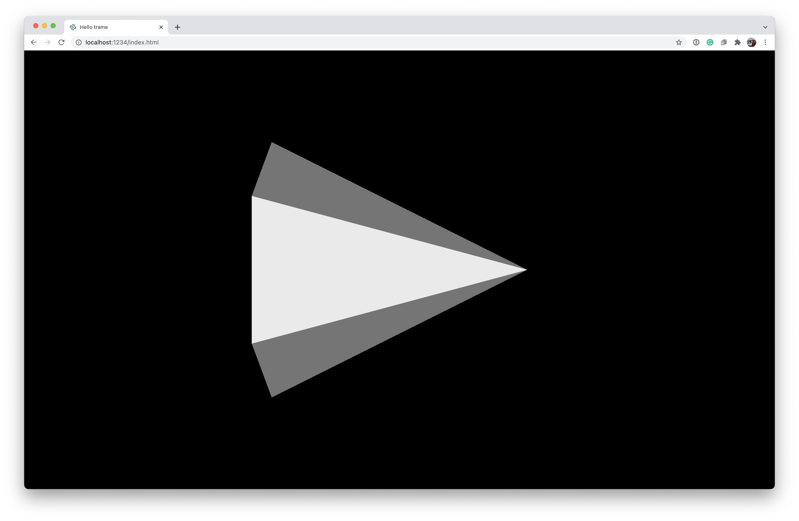
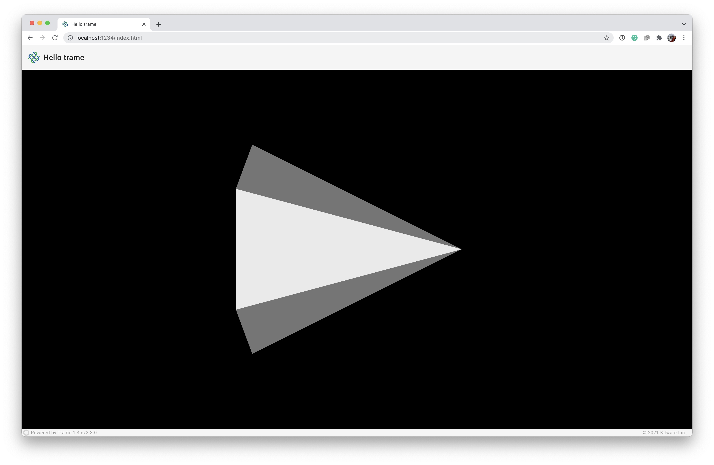
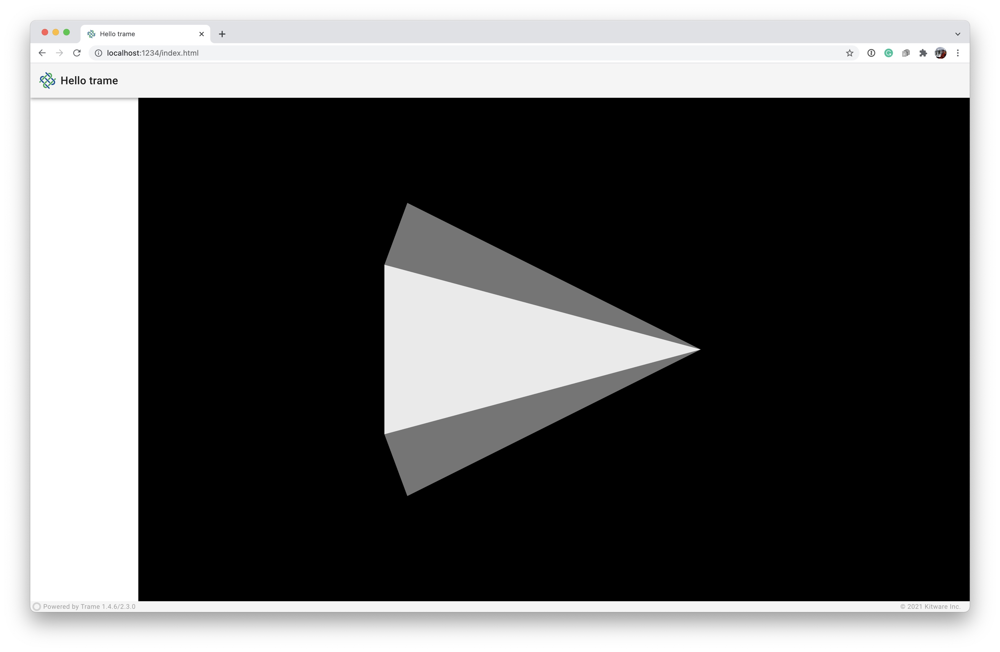

# Layouts

To simplify creation of the graphical user interface (GUI) for the web application, ***trame.ui.vuetify*** defines layouts objects such as `VAppLayout`, `SinglePageLayout`, and `SinglePageWithDrawerLayout`.
In addition to these `vuetify` layouts we also have a simple `trame.ui.html.DivLayout`.

All core layouts start with a `VApp` (Vuetifies `v-app`) component. The `VApp` is **REQUIRED** for all applications. It is the mount point for other Vuetify components and functionality and ensures that it propagates the default application variant (dark/light) to children components, and ensures proper cross-browser support for certain click events in browsers like Safari. `VApp` should only be rendered within your application **ONCE**. (More on Vuetify in the next chapter of the tutorial.)

Each of these layouts can be utilized by importing, instantiating, and serving it via the `server.start()` function.

<div class="print-break"></div>

## `VAppLayout` or fullscreen

If you want to experiment with it you can edit `02_layouts/app_cone.py` which was the latest cone example we built using the `SinglePage` layout.

The `VAppLayout` starts with VApp and exposes the children array where one could add in other desired HTML elements (Vuetify UI Components).

<p style="text-align:center;"></p>

**First**, add the import to `VAppLayout`.

```python
from trame.ui.vuetify import VAppLayout
```

**Second**, we instantiate the `layout` object, create the `vtk.VtkLocalView` component, and add it directly to its `root` element using a Vuetify `VContainer` with arguments descripted in the [VTK](tutorial-vtk.html) chapter.

```python
with VAppLayout(server) as layout:
    with layout.root:
        with vuetify.VContainer(
            fluid=True,
            classes="pa-0 fill-height",
        ):
            view = vtk.VtkLocalView(renderWindow)
            ctrl.on_server_ready.add(view.update)
```

**Finally**, we start the server

```python
if __name__ == "__main__":
    server.start()
```

The `VAppLayout` is really a blank canvas to add your desired Vuetify components.

**Running the Application**

```bash
python 02_layouts/app_cone.py --port 1234
# or
python 02_layouts/solution_FullScreenPage.py --port 1234
```

<div class="print-break"></div>

## `SinglePageLayout`

The `SinglePageLayout` extends the `VAppLayout` with a few predefined components such as *icon*, *title*, *toolbar*, *content*, and *footer*.

<p style="text-align:center;"></p>

The *icon* and *title* sit on the left-hand side of the *toolbar* and are customized as necessary. The icon is a *VAppBarNavIcon*  which can be customized by adding a child to it such as a VIcon with a [Material Design Icons](https://materialdesignicons.com/). The *toolbar* itself exposes its *children* array in which one can add components as needed. The *footer* can be hidden, but currently has ***trame*** branding, the progress bar and list of trame modules available with their versions. The *content* is just a **VMain** to which you may add your desired Vuetify components.

**First**, we import the `SinglePageLayout` class.

```python
from trame.ui.vuetify import SinglePageLayout
```

**Second**, we instantiate the `layout` object, maybe change the title, create the `vtk.VtkLocalView` component, and add it to the `content` component's `children` using a Vuetify `VContainer` with arguments descripted in the [VTK]() chapter.

```python
with SinglePageLayout(server) as layout:
    layout.title.set_text("Hello trame")

    with layout.content:
        with vuetify.VContainer(
            fluid=True,
            classes="pa-0 fill-height",
        ):
            view = vtk.VtkLocalView(renderWindow)
            ctrl.on_server_ready.add(view.update)

```

**Finally**, we start the server

```python
if __name__ == "__main__":
    server.start()
```

**Running the Application**

```bash
python 02_layouts/app_cone.py --port 1234
# or
python 02_layouts/solution_SinglePage.py --port 1234
```

<div class="print-break"></div>

## `SinglePageWithDrawerLayout`

The `SinglePageWithDrawerLayout` extends the `SinglePageLayout` with a *drawer*. You can show and hide the *drawer* by clicking on the application *icon* on the *toolbar*. You can use the *drawer* to add any necessary Vuetify components.

<p style="text-align:center;"></p>

**First**, we import the `SinglePageWithDrawerLayout` class.

```python
from trame.ui.vuetify import SinglePageWithDrawerLayout
```

**Second**, we instantiate the `layout` object with access to everything within the `SinglePageLayout` layout.

```python
with SinglePageWithDrawerLayout(server) as layout:
    layout.title.set_text("Hello trame")

    with layout.content:
        with vuetify.VContainer(
            fluid=True,
            classes="pa-0 fill-height",
        ):
            view = vtk.VtkLocalView(renderWindow)
            ctrl.on_server_ready.add(view.update)

```

**Finally**, we start the server

```python
if __name__ == "__main__":
    server.start()
```

**Running the Application**

```bash
python 02_layouts/app_cone.py --port 1234
# or
python 02_layouts/solution_SinglePageWithDrawer.py --port 1234
```
