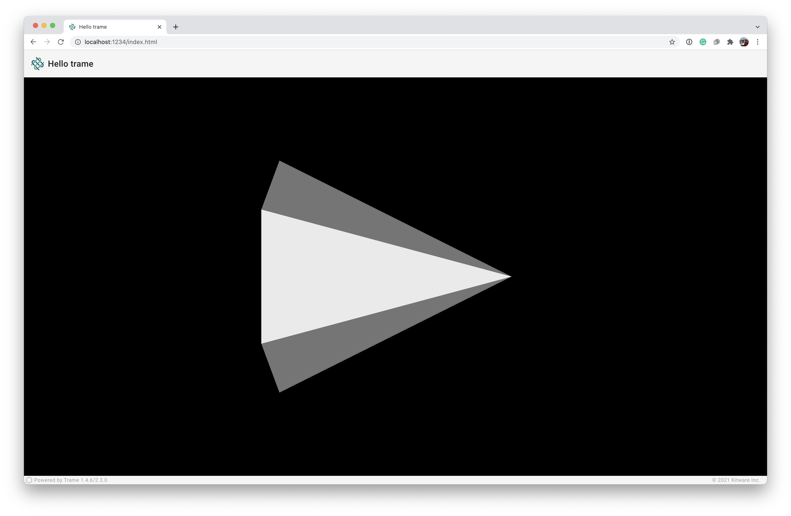
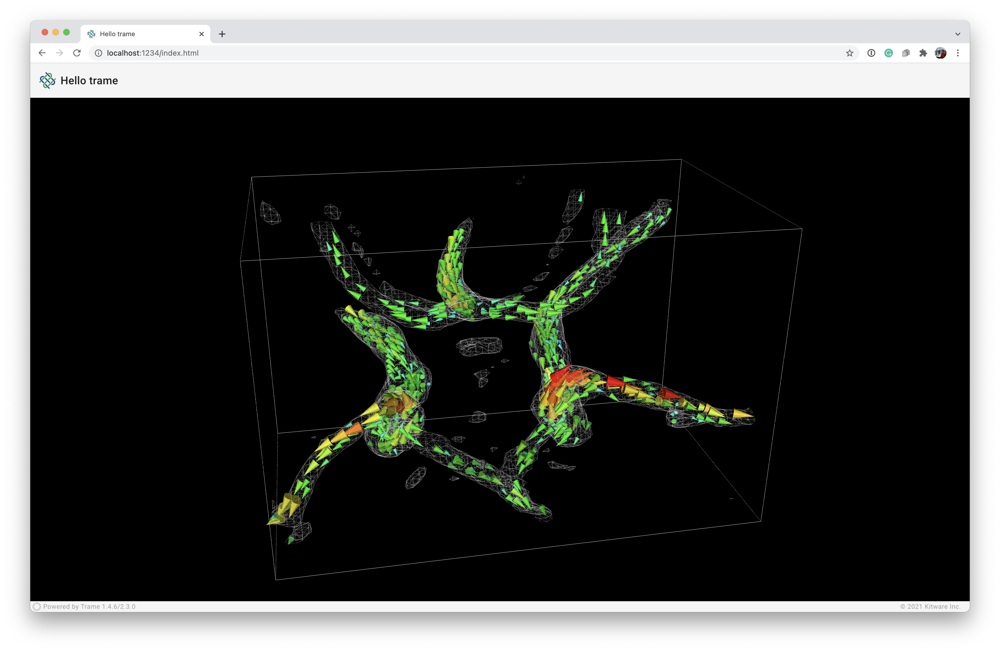

## VTK

In this step we start adding VTK visualizations to our application.

## VTK Imports

Start editing the file in `01_vtk/app_cone.py` which has the same content as `00_setup/app.py`.

**First**, what we need to add is an import for `vtk` and `vuetify` from `trame.widgets`.

```python
from trame.widgets import vtk, vuetify
```

This provides us access to ***trame***'s widgets for vtk and vuetify.

**Next**, we will need to import the required objects from VTK. We will visualize a simple cone in this example so we will need `vtkConeSource`.

```python
from vtkmodules.vtkFiltersSources import vtkConeSource
```

Other VTK objects will need to be imported based on the desired visualization pipelines.

**Next**, we need to import the VTK rendering core

```python
from vtkmodules.vtkRenderingCore import (
    vtkActor,
    vtkPolyDataMapper,
    vtkRenderer,
    vtkRenderWindow,
    vtkRenderWindowInteractor,
)
```

**Finally**, we need to import the required modules for the interactor and rendering.

`vtkInteractorStyleSwitch` is required for the interactor initialization.

```python
from vtkmodules.vtkInteractionStyle import vtkInteractorStyleSwitch #noqa
```

The `vtkRenderingOpenGL2` module is required for the rendering initialization. It is not necessary for local rendering, but you'll want to include it so that you can seamlessly switch between *local* and *remote* rendering.

```python
import vtkmodules.vtkRenderingOpenGL2 #noqa
```

**Note**: `#noqa` tells the linter to ignore checking this problematic line.

<div class="print-break"></div>

## VTK Pipeline

As promised, to add visualization to your ***trame*** application you simply write VTK pipelines in Python.

<p style="text-align:center;"></p>

There are a number of ways to learn VTK:

- [VTK User Guide](https://www.kitware.com/products/books/VTKUsersGuide.pdf)
- [VTK Textbook](https://gitlab.kitware.com/vtk/textbook/raw/master/VTKBook/VTKTextBook.pdf)
- [VTK Examples](https://kitware.github.io/vtk-examples/site/Python)
- [VTK Documentation](https://www.vtk.org/doc/nightly/html/)

This tutorial does not provide an adequate background for VTK, but in the following we will explain the pieces and parts of the provided VTK examples at a high level.

**First**, we create a `vtkRenderer` and `vtkRenderWindow`. The we tie them together by adding the `renderer` to the `renderWindow`.

```python
renderer = vtkRenderer()
renderWindow = vtkRenderWindow()
renderWindow.AddRenderer(renderer)
```

**Second**, we define a `vtkRenderWindowInteractor` which provides a platform-independent interaction mechanism for mouse/key/time events.

```python
renderWindowInteractor = vtkRenderWindowInteractor()
renderWindowInteractor.SetRenderWindow(renderWindow)
renderWindowInteractor.GetInteractorStyle().SetCurrentStyleToTrackballCamera()
```

We create the interactor, associate it with the `renderWindow` and set the interaction style.

**Third**, we create the desired visualization. This process requires the creation of an object, a mapper, and an actor (these constitute a simple VTK pipeline).

```python
cone_source = vtkConeSource()
mapper = vtkPolyDataMapper()
mapper.SetInputConnection(cone_source.GetOutputPort())
actor = vtkActor()
actor.SetMapper(mapper)
```

The instantiated `vtkConeSource` is our mesh source that will produce a vtkPolyData. Then we want to map it to a graphical representation by creating a `vtkPolyDataMapper`. We must create a connection from the cone to the mapper by setting the input connection. We then create an actor and connect the mapper to the actor. (In VTK, actors are objects displayed by a renderer.)

**Finally**, we add all the pipelines (actors) to the `renderer`, reset the camera, and render.

```python
renderer.AddActor(actor)
renderer.ResetCamera()
```

The VTK specific imports and pipelines defined for a ***trame*** application are precisely the specific imports and pipelines required for a Python VTK script.

## Local and Remote Rendering

Why do we care about *local* and *remote* rendering? Well each method of rendering has it's advantages and disadvantages. To a large extent it is a matter of data scale as described in the following.

**Local Rendering**

*Advantages*

- The server doesn't need a graphics processing unit (GPU). Systems with GPUs are expensive to purchase and expensive to rent (cloud). These costs are pushed to the end-points on end-users.
- The performance as measured in frames per second (fps) rendering is higher when using local rendering. Recent advancements in the browser's access to local GPU resources means that rendering performance through the web browser is nearly as good as available to a desktop application.

*Disadvantages*

- The data to be rendered must be transferred from the server to the client. This transfer may be too slow, and the data may be too large for the browser to manage.
- How and where will the data be processed into graphic primitives? The processing may increase load and latency on the server side or the client side.

**Remote Rendering**

*Advantages*

- The data to be rendered doesn't move, only the resulting rendered image is transmitted.
- Rendering can utilize parallel and distributed processing to handle extremely large data.
- The server can serve a more diverse set of clients. From cell phone to workstation, the client requirements is limited to receiving and rendering images.

*Disadvantages*

- Rendering fps might be capped by the speed and latency of image delivery.
- The servers have to be more capable. Remote software rendering is possible, but the framerates will be further impacted.

**Implementation**

Down in the GUI section of the application, we **first** need to select a rendering method.

For *local rendering*

```python
html_view = vtk.VtkLocalView(renderWindow)
```

for *remote rendering*

```python
html_view = vtk.VtkRemoteView(renderWindow)
```

and define a container to hold the renderer:

```python
with SinglePageLayout(server) as layout:
    # [...]

    with layout.content:
        with vuetify.VContainer(
            fluid=True,
            classes="pa-0 fill-height",
        ):
            # html_view = vtk.VtkLocalView(renderWindow)
            html_view = vtk.VtkRemoteView(renderWindow)
            # TODO: missing update when ready...
```

We add a **Vuetify** component to the Web application. In this case, a `VContainer`. The arguments include: fluid (to get full width container), classes (CSS stylings), and nest our rendering view component into it.

(More information is available for [vuetify](https://vuetifyjs.com/en/introduction/why-vuetify/).)

## Update and Start

Once the client and server are ready, we need to update the view (`html_view`) by calling  `html_view.update()`.

To enable this call, we need to use the server controller on which we can attach method(s) for various life cycle events.
The one we are interested here is **on_server_ready** on which to which we can bind our **update** method.

To do so, we revist our code base to extract our server controller and **add** our method to be called on the proper **on_server_ready** life cycle.

```python
ctrl = server.controller                                    # <--- New line

with ... as layout:
    with layout.content:
        with vuetify.VContainer(...):
            # html_view = vtk.VtkLocalView(renderWindow)
            html_view = vtk.VtkRemoteView(renderWindow)
            ctrl.on_server_ready.add(html_view.update)      # <--- New line
```

## Running the Application

```bash
python ./01_vtk/app_cone.py --port 1234
```

Your browser should open automatically to `http://localhost:1234/`

## Interaction

- Rotate: Hold down the mouse and move
- Zoom: Hold down mouse + control key and move up (out) and down (in)
- Pan: Hold down the mouse + option key and move

## Other VTK Examples

Now you can take most of the code examples at [VTK Examples](https://kitware.github.io/vtk-examples/site/Python) and port them to ***trame***.

<a href="https://kitware.github.io/vtk-examples/site/Python/VisualizationAlgorithms/CarotidFlowGlyphs/"><p style="text-align:center;"></p></a>

We are going to implement [CarotidFlowGlyphs](https://kitware.github.io/vtk-examples/site/Python/VisualizationAlgorithms/CarotidFlowGlyphs/) by editing the file in `01_vtk/app_flow.py.py` which start from our cone rendering example solution.

<div class="print-break"></div>

**Imports**

We are going to read a file, requiring the import of the `os` module and set the current directory. Starting with our Hello ***trame*** cone application, we add

```python
import os

CURRENT_DIRECTORY = os.path.abspath(os.path.dirname(__file__))
```

We replaced the imports for our cone VTK pipeline

```python
from vtkmodules.vtkFiltersSources import vtkConeSource
```

with imports for multiple VTK pipelines

```python
from vtkmodules.vtkCommonColor import vtkNamedColors
from vtkmodules.vtkCommonCore import vtkLookupTable
from vtkmodules.vtkFiltersCore import (
    vtkContourFilter,
    vtkGlyph3D,
    vtkMaskPoints,
    vtkThresholdPoints
)
from vtkmodules.vtkFiltersModeling import vtkOutlineFilter
from vtkmodules.vtkFiltersSources import vtkConeSource
from vtkmodules.vtkIOLegacy import vtkStructuredPointsReader
```

to create three-dimensional (3D) contours of the carotid artery, 3D Glyphs of the flow field at various points, and an outline of the computational domain.

**Pipelines**

**First**, we replaced the cone pipeline line 36-40

```python
cone_source = vtkConeSource()
mapper = vtkPolyDataMapper()
mapper.SetInputConnection(cone_source.GetOutputPort())
actor = vtkActor()
actor.SetMapper(mapper)
```

With our three pipelines for the glyphs, contours, and outline.

We read the data using the `vtkStructuredPointsReader` and the full file path, provided by adding `CURRENT_DIRECTORY` to the beginning of the relative file path.

```python
# Read the Data

reader = vtkStructuredPointsReader()
reader.SetFileName(os.path.join(CURRENT_DIRECTORY, "../data/carotid.vtk"))
```

<div class="print-break"></div>

```python
# Glyphs
threshold = vtkThresholdPoints()
threshold.SetInputConnection(reader.GetOutputPort())
threshold.ThresholdByUpper(200)

mask = vtkMaskPoints()
mask.SetInputConnection(threshold.GetOutputPort())
mask.SetOnRatio(5)

cone = vtkConeSource()
cone.SetResolution(11)
cone.SetHeight(1)
cone.SetRadius(0.25)

cones = vtkGlyph3D()
cones.SetInputConnection(mask.GetOutputPort())
cones.SetSourceConnection(cone.GetOutputPort())
cones.SetScaleFactor(0.4)
cones.SetScaleModeToScaleByVector()

lut = vtkLookupTable()
lut.SetHueRange(.667, 0.0)
lut.Build()

scalarRange = [0] * 2
cones.Update()
scalarRange[0] = cones.GetOutput().GetPointData().GetScalars().GetRange()[0]
scalarRange[1] = cones.GetOutput().GetPointData().GetScalars().GetRange()[1]

vectorMapper = vtkPolyDataMapper()
vectorMapper.SetInputConnection(cones.GetOutputPort())
vectorMapper.SetScalarRange(scalarRange[0], scalarRange[1])
vectorMapper.SetLookupTable(lut)

vectorActor = vtkActor()
vectorActor.SetMapper(vectorMapper)

# Contours
iso = vtkContourFilter()
iso.SetInputConnection(reader.GetOutputPort())
iso.SetValue(0, 175)

isoMapper = vtkPolyDataMapper()
isoMapper.SetInputConnection(iso.GetOutputPort())
isoMapper.ScalarVisibilityOff()

isoActor = vtkActor()
isoActor.SetMapper(isoMapper)
isoActor.GetProperty().SetRepresentationToWireframe()
isoActor.GetProperty().SetOpacity(0.25)

# Outline
colors = vtkNamedColors()

outline = vtkOutlineFilter()
outline.SetInputConnection(reader.GetOutputPort())

outlineMapper = vtkPolyDataMapper()
outlineMapper.SetInputConnection(outline.GetOutputPort())

outlineActor = vtkActor()
outlineActor.SetMapper(outlineMapper)
outlineActor.GetProperty().SetColor(colors.GetColor3d("White"))

```

**Note**: In the Colors and Data section we instantiated a helper for accessing named colors and read the desired data file on the **server**.

**Finally**, we replace the single cone pipeline actor

```python
renderer.AddActor(actor)
```

with three pipeline actors associated with the renderer.

```python
renderer.AddActor(outlineActor)
renderer.AddActor(vectorActor)
renderer.AddActor(isoActor)
```

Our pipelines are the same pipelines used in [VTK Examples](https://kitware.github.io/vtk-examples/site/Python) except for some cosmetic edits (e.g., using `renderer` and `renderWindow` is clearer than `ren1` and `renWin`).

**Running the Application**

```bash
python ./01_vtk/app_flow.py --port 1234
```

Your browser should open automatically to `http://localhost:1234/`

## Ray Casting example

Left as an exercise to the reader, implement the Volume Rendering example [Simple Ray Cast](https://kitware.github.io/vtk-examples/site/Python/VolumeRendering/SimpleRayCast/) using **trame**.

The solution of that example is available at `01_vtk/solution_ray_cast.py`.
