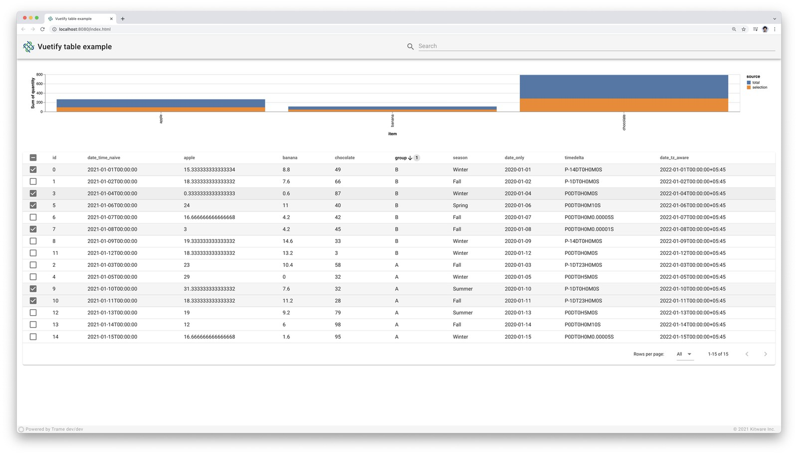

# Vuetify based examples

This directory gather several examples involving in various way the vuetify module.

## Dataframe to table

This example illustrates how Vuetify tables can easily display tabular data from sources like a Pandas dataframe.



## Menu

This example illustrates how to implement a dropdown menu in vuetify using `v-slot:activator` with `v-bind` and `v-on` like this one:

```html
<template>
  <v-menu>
    <template v-slot:activator="{ on, attrs }">
      <v-btn v-bind="attrs" v-on="on"> Dropdown </v-btn>
    </template>
    <v-list>
      <v-list-item v-for="(item, index) in items" :key="index">
        <v-list-item-title>{{ item.title }}</v-list-item-title>
      </v-list-item>
    </v-list>
  </v-menu>
</template>
```

And demonstrate how to pass variables from Vue to a Python method.

## Router

This example make usage of various vuetify widgets in a context of routes and several page content.
