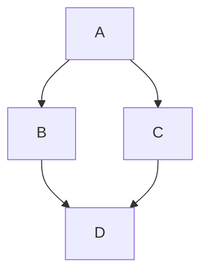

# markdown-it-vue

## Image size and Viewer


## GitHub Table of Contents

[toc]

Note: Only `h2` and `h3` are shown in toc.

## alter

Markup is similar to fenced code blocks. Valid container types are `success`, `info`, `warning` and `error`.

::: success
You have got it.
:::

::: info
You have new mail.
:::

::: warning
You have new mail.
:::

::: error
Staying up all night is bad for health.
:::

## mermaid charts

### mermaid Flowchart

[Flowchart Syntax](http://knsv.github.io/mermaid/#flowcharts-basic-syntax)



```
sequenceDiagram
    participant Alice
    participant Bob
    Alice->John: Hello John, how are you?
    loop Healthcheck
        John->John: Fight against hypochondria
    end
    Note right of John: Rational thoughts <br/>prevail...
    John-->Alice: Great!
    John->Bob: How about you?
    Bob-->John: Jolly good!
```

## Definition list

Term 1
  ~ Definition 1

Term 2
  ~ Definition 2a
  ~ Definition 2b

[Definition List Syntax](http://pandoc.org/README.html#definition-lists)


## AsciiMath

```ASCIIMath
phi_n(kappa) = 1/(4pi^2 kappa^2)
 int_0^oo (sin(kappa R))/(kappa R)
 del/(del R)
[R^2 (del D_n (R))/(del R)] del R
```

[AsciiMath Documentation](http://asciimath.org/)

## Subscript: H~2~O

You can also use inline math: `$H_2O$`


## Superscript: 29^th^

You can also use inline math: `$29^{th}$`


## Emoji: :panda_face: :sparkles: :camel: :boom: :pig:

[Emoji Cheat Sheet](http://www.emoji-cheat-sheet.com/)

## code

### c
```c
#include <stdio.h>
int main(int argc char* argv[]) {
  printf("Hello, World!");
  return 0;
}
```

### json

```json
{
  "name": "markdown-it-vue"
}
```

### javascript
```javascript
import MarkdownItVue from 'markdown-it-vue'
export default {
  components: {
    MarkdownItVue
  }
}
```

### bash
```bash
npm install markdown-it-vue
```

## table

| First Header  | Second Header |
| ------------- | ------------- |
| Content Cell  | Content Cell  |
| Content Cell  | Content Cell  |
